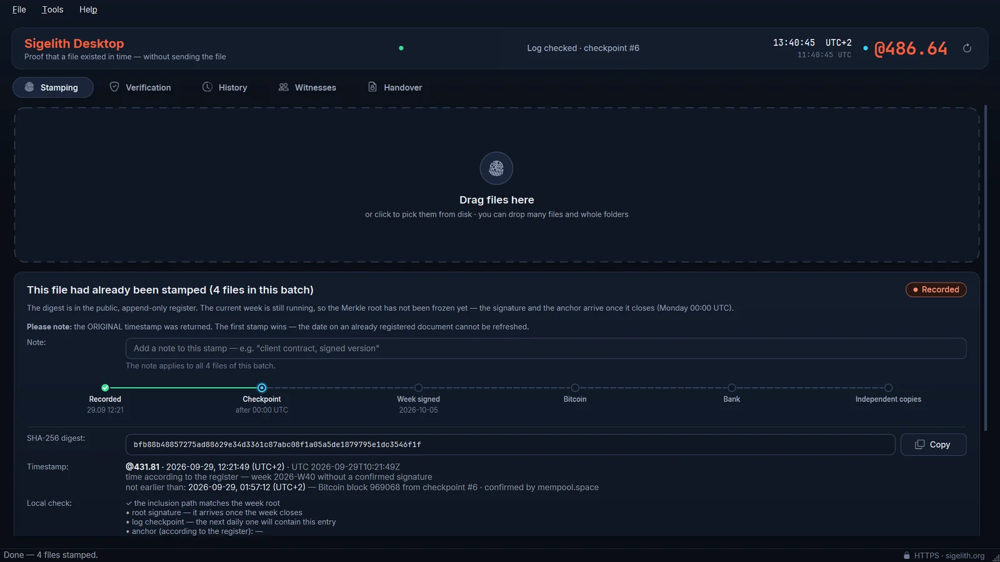
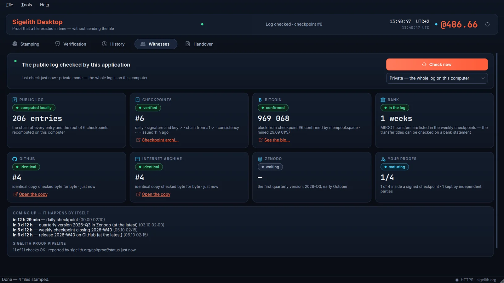
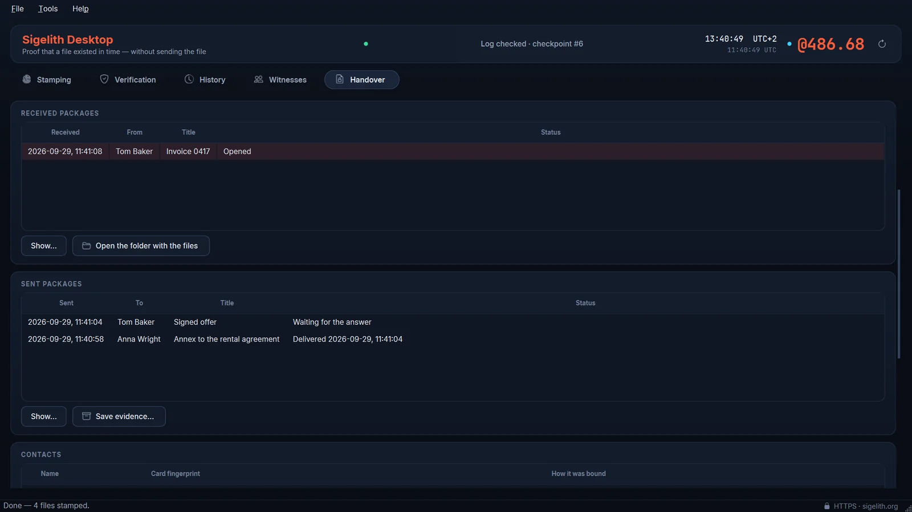

# Sigelith Desktop

A Windows desktop client for [Sigelith](https://sigelith.org), the public
**proof-of-existence** log. It gives a file a timestamp you can later use to
show that the document existed at a given moment and has not changed since.

**Your file never leaves the computer.** The only thing that goes out is the
64-character SHA-256 hash computed locally — not the name, not the contents,
not the size.

<a href="https://apps.microsoft.com/detail/9n5xk65gtf33?mode=direct"></a>

**Free in the [Microsoft Store](https://apps.microsoft.com/detail/9n5xk65gtf33)** (Windows 10 22H2 or Windows 11, 64-bit) — the Store version updates itself. From the command line: `winget install --id 9N5XK65GTF33 --source msstore`. Or build it from source (below).

[](https://github.com/DeiFlagellum/sigelith-desktop/actions/workflows/tests.yml)

| Stamp a file | Watch the log's witnesses | Hand over with proof of delivery |
|---|---|---|
|  |  |  |

---

## Formerly BeatStamp

On **2026-09-27** this program was renamed from **BeatStamp** to
**Sigelith Desktop** (version 3.0.1). The proof-of-existence infrastructure it
talks to — the public log, its signed checkpoints, the certificates and the
verification API — was first published as "BeatTime proof" at
[beattime.live](https://beattime.live) and is now called **Sigelith**, at
[sigelith.org](https://sigelith.org). The time notation is written simply
`.beat` (@beat, 1000 beats a day); BeatTime survives only as the store names
of the two clock apps on Google Play.

What that means in practice:

- **Nothing about existing proofs changes.** sigelith.org and beattime.live are
  served by one system, with one log and one signing key, and beattime.live
  keeps working. Every proof issued under the name BeatTime keeps verifying.
- **File formats are unchanged.** Proof files still use the `.beatproof`
  extension and the `beatproof-v1` format; the identifiers inside signed data
  (`beattime-proof-v1`, `beattime-entry-v1`, `beattime-checkpoint-v1`) keep
  their names, because they are part of what is signed. Proofs saved by
  BeatStamp open and verify in Sigelith Desktop.
- **Your data comes along.** On first start the program copies your history,
  settings and witness state from `%USERPROFILE%\BeatStamp` to
  `%USERPROFILE%\Sigelith`. The old folder is left untouched (with a short
  note saying where the data went), so you can delete it yourself once you are
  sure everything is in the new place.
- The public repository of weekly log releases is now
  [DeiFlagellum/sigelith-log](https://github.com/DeiFlagellum/sigelith-log)
  (the old name redirects).

The naming history is documented at
[sigelith.org/spec/#naming](https://sigelith.org/spec/#naming).

## What a timestamp here proves — and what it does not

It proves **existence at a point in time** and **integrity**: this exact
sequence of bytes existed by then, and it is unchanged. That is all, and the
app says so in the same words.

It does **not** prove authorship, ownership, or that anything in the document
is true. It is not a qualified electronic timestamp under eIDAS.

## How a proof matures

A fresh stamp is not yet worth much; it becomes evidence over about a week,
in three steps the app shows honestly rather than rounding up to "verified":

1. **Recorded** — the hash is in the public append-only log with its @beat and
   UTC time, in a hash chain with its neighbours.
2. **Sealed** — at the end of the ISO week every hash of that week is combined
   into a Merkle root, which is signed with an Ed25519 key.
3. **Anchored** — that weekly root is published into Bitcoin through
   [OpenTimestamps](https://opentimestamps.org) and against an independent bank
   reference. From then on the timestamp no longer rests on anyone's word.

Since 2.2 the app shows the whole **journey of a proof**: recorded → inside a
signed **checkpoint** of the global log → week signed → Bitcoin → bank →
**independent copies** of that checkpoint at GitHub, the Internet Archive and
Zenodo. While the app is open, proofs mature by themselves (every 15 minutes,
no notifications).

## The app as a witness of the log

A single proof shows that your hash is in a signed tree. It does not show that
Sigelith presents the *same* history to everybody. So Sigelith Desktop audits
the public log itself, in the background:

- it downloads every signed **checkpoint** as raw bytes and checks its Ed25519
  signature, its key and the `prev` chain back to checkpoint #1;
- it checks the **RFC 9162 consistency proof** between checkpoints — nothing
  removed, nothing rewritten — and in private mode recomputes every checkpoint
  root from its own copy of the whole log;
- it compares checkpoints byte for byte with the **copies kept by third
  parties** (immutable GitHub releases, the Internet Archive, Zenodo) and the
  Bitcoin block named in each checkpoint with an **independent block explorer**.

Two different signed files under one checkpoint number, a checkpoint that does
not extend the previous one, or a signed third-party copy that differs, raise an
alarm, and the conflicting files are kept as evidence. The format is specified in
[`LOG.md`](https://sigelith.org/spec/).

## Verifying without trusting the server

This is the point of the program, so it does the checking itself rather than
asking the server whether everything is fine:

- **It recomputes the inclusion path.** From your file's hash and the sibling
  hashes it walks up the Merkle tree (RFC 6962) and compares the result with
  the published weekly root. A proof that does not recompute is rejected.
- **It verifies the Ed25519 signature offline**, against a list of public keys
  compiled into the program — not against whatever key the server sends. A
  signature made with a **retired** key can never raise a proof above
  "recorded", and the app says why.
- **It checks the time.** A stamp whose timestamp falls outside the week its
  root covers is refused, however well-formed the rest is.
- **It reads `.beatproof` files offline.** Everything needed to check a proof
  fits in one file; verification needs no network and no account.

The server that issues these proofs is not open source. That is precisely why
the client is: the proof is designed so that you do not have to believe either
of them. Everything above can be recomputed from public data — the weekly
roots are on [sigelith.org/proof](https://sigelith.org/proof/), and the
format is specified at [sigelith.org/spec](https://sigelith.org/spec/).

## Sigelith Handover — proof of delivery

Send files so that the recipient confirms receipt with their own key, held by
Windows Hello, and the moment of delivery is recorded in the public log. The
encrypted package travels between the two of you — by e-mail, a messenger, a
USB stick or a shared folder. Sigelith's server stores no files, messages or
accounts; it only stamps 32-byte digests.

- The recipient's signed acceptance takes effect only when the sender records
  the missing key part in the log before the acceptance's deadline — that
  moment is the delivery, and from then on the recipient can open the files.
- The evidence package (`.sigelith-evidence.zip`) can be checked by anyone,
  in this app or at
  [sigelith.org/handover/verify/](https://sigelith.org/handover/verify/), in
  the browser, without trusting Sigelith. For a reader without a verifier the
  app saves a PDF report with every check and how to repeat it.
- A package that does not open the way it was offered gives the recipient a
  defect proof (`.sigelith-defect.zip`) that anyone can recompute; a false
  claim fails the same computation.

It proves that the recipient's key accepted the package and when it became
readable — not that anyone read it, and not who stands behind a key. It is not
a formal service of documents under any particular law; what it weighs in a
dispute is for a court to decide. Formats, verification rules, the threat
analysis and the test vectors (`tests/vectors/handover-v1.json`) are in
[`docs/HANDOVER_SPEC.md`](docs/HANDOVER_SPEC.md) — `sigelith-handover-v1`.

## Privacy

No account, no telemetry, no analytics, no advertising identifiers. Your
history is a local file you can read, copy or delete.

- **Private mode (default)** keeps a copy of the whole public log (hashes only,
  which are public anyway) and computes every proof locally. Refreshing your
  history or checking someone else's file does not tell the server which hash
  you care about. **Fast mode** asks the server about each hash instead.
- Stamping sends the hash of the file — that is its only purpose. The file
  itself never leaves your computer.
- The witness checks fetch **public Sigelith files** from GitHub, the Internet
  Archive and Zenodo, and **Bitcoin block headers** from mempool.space or
  blockstream.info. Nothing about your documents is sent. This can be turned
  off in Settings → Witnesses.

## Install

Windows 10 22H2 or Windows 11, 64-bit:

- **Microsoft Store** — [Sigelith Desktop](https://apps.microsoft.com/detail/9n5xk65gtf33); the
  Store keeps it up to date.
- **winget** — `winget install --id 9N5XK65GTF33 --source msstore` (the same Store package).
- **From source** — see [Run and build from source](#run-and-build-from-source) below.

Releases on this page carry the source of each version; the program itself is distributed
through the Microsoft Store. Nothing is written outside your user profile.

Your data lives in `%USERPROFILE%\Sigelith` (history, settings, log). That
location is deliberate: `Documents` is protected by Windows ransomware
protection, which blocks unknown programs from writing there, and a program
that stores evidence cannot depend on whether Windows feels like trusting the
build you downloaded today. Data from an earlier BeatStamp installation
(`%USERPROFILE%\BeatStamp`) is copied over on first start.

## Run and build from source

Python 3.14.7 or newer (earlier 3.14 releases for Windows ship OpenSSL 3.0,
which is out of support):

```powershell
py -3.14 -m venv .venv
.\.venv\Scripts\Activate.ps1
pip install -r requirements.txt
python beatstamp_main.py
```

The Python package is still called `beatstamp` — renaming it is a separate
step; the program name, the executable and everything you see are Sigelith
Desktop.

Build a standalone package (PyInstaller, one directory):

```powershell
pip install -r requirements-dev.txt
.\build.ps1
```

Tests (over 800, no network required; GitHub Actions runs them on every push — tests that
compare the app with the server's code are skipped outside the Sigelith source tree):

```powershell
python -m unittest discover -s tests
```

A built copy can check itself:

```
SigelithDesktop.exe --selftest --offline
```

Earlier versions used Polish flag names. `--samokontrola` and `--bez-sieci`
still work and always will: once a program is published, its command-line
flags are a public interface, and quietly dropping one breaks somebody's
script for no good reason. For the same reason the environment variable
`BEATSTAMP_DATA_DIR` (portable data folder) is still honoured next to the new
`SIGELITH_DATA_DIR`.

## Interface languages

The same eleven languages as the Sigelith website and the mobile app
(*BeatTime: Universal Clock* on Google Play): English, Polish, German, Spanish, French, Russian,
Turkish, Japanese, Korean, Simplified Chinese and Arabic (the window is
mirrored right-to-left). On first start the app follows the Windows display
language, falling back to English; it can be switched in Settings.

The PDF certificate is issued in the interface language. Japanese, Korean and
Chinese certificates use a Windows system font (Yu Gothic, Malgun Gothic,
Microsoft YaHei), embedded as a subset of the characters used. Arabic
certificates are issued in English: the PDF library cannot shape Arabic
letters, and a certificate must not print them broken.

## Coming from TimeVaultSecure?

TimeVaultSecure (timevaultsecure.com) is an earlier product by the same
author, and Sigelith Desktop takes over the history it left behind. Your old
entries are imported and kept, but they are labelled **TVS archive** and they
stay at that level — they are not silently promoted to look like the new
proofs.

The reason is in the old design: that client's proof rested on trusting the
server's answer, and its `signature` field was a concatenation that nothing
could verify. Those records still say what you stamped and when you stamped
it, which is worth keeping; what they cannot do is prove it to a third party.
New stamps can, which is the whole difference.

## Licence

Apache License 2.0 — see [LICENSE](LICENSE).

The program bundles Qt via **PySide6 under LGPLv3**, plus OpenSSL, CPython,
reportlab and others. [NOTICE](NOTICE) lists every component with its licence
and tells you where to get the sources of the LGPL libraries; the full licence
texts are in [`licenses/`](licenses/). The notices are generated from the built
package, not from a dependency list, so a library that ships is a library that
is listed.

One module was deliberately left out: **Qt Virtual Keyboard**, which is
available only commercially or under GPLv3. An on-screen keyboard was not
worth changing the licence of the whole program, and a test fails the build if
it ever reappears in a package.

## Reporting a problem

Security issues: see [SECURITY.md](SECURITY.md) — reports go privately to the contact in
[sigelith.org/.well-known/security.txt](https://sigelith.org/.well-known/security.txt).
Anything else: open an issue here.

---

Sigelith Desktop is the desktop side of [Sigelith](https://sigelith.org) —
public, verifiable proof that a file existed at a point in time. Times are
shown in [@beat](https://sigelith.org/beat/) as well: 1000 beats a day, anchored to UTC,
with no timezones.
